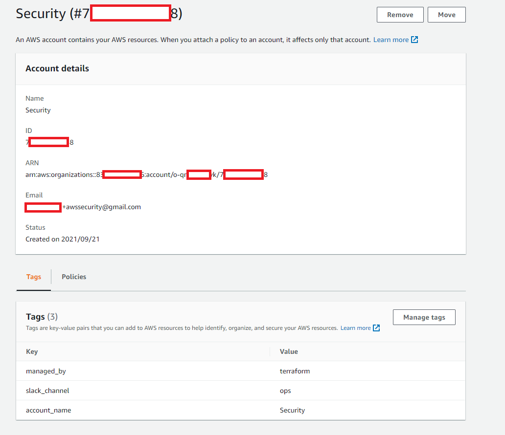
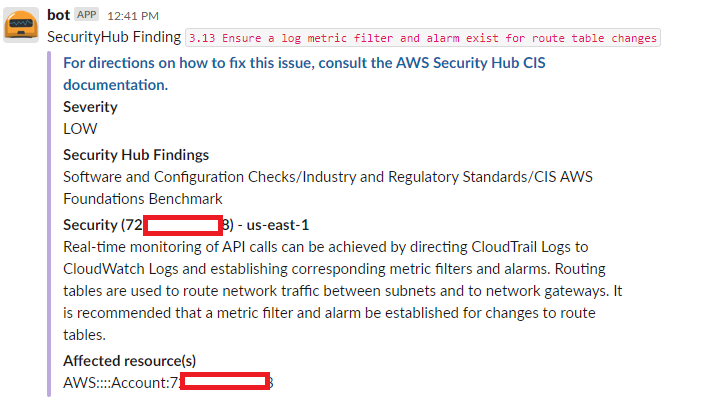
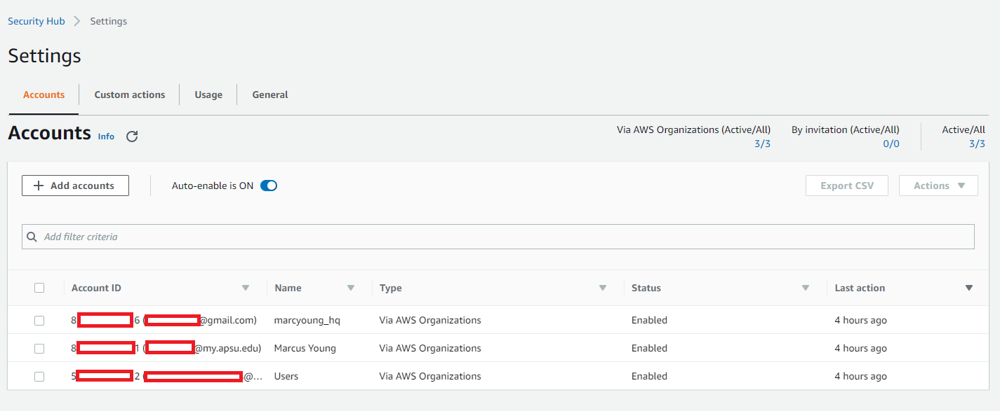

YAWPS
=====

## **Y**et **A**nother **W**orkflow **P**arser for **S**ecurityHub


"Screaming pepper" by Rum Bucolic Ape is licensed with CC BY-ND 2.0. To view a copy of this license, visit https://creativecommons.org/licenses/by-nd/2.0/

## Purpose ##

Currently SecurityHub has a ChatBot integration thats a bit lacking.
All of securityhub goes to chatbot, which means a singular flooding channel of alerts.

With [cloud-custodians recent support for securityhub](https://cloudcustodian.io/docs/aws/topics/securityhub.html) and [organizations](https://cloudcustodian.io/docs/tools/c7n-org.html) we have a good way to send all alerts for an entire org to slack. But that means every account goes to a single channel.

This repo is part of a multi-series talk/demo on how to intelligently route account messages to differing Slack channels.

In the scenario where a team owns an account it would be nice to let cloud-custodian generate meaningful securityhub notifications that go to specific team channels.

For this talk we will simply tag AWS accounts with 2 tags `account_name` (a human readable name) and `slack_channel` (a slack channel to direct those security hub notifications to).





A blog post and KubeCon talk will be coming soon with more information

## Prerequisites ##

The only real pre-requisite here is a working [multi-account SecurityHub](https://docs.aws.amazon.com/securityhub/latest/userguide/securityhub-accounts.html)



## Configuration ##

| Environment Variable | Description |
| --- | --- |
| `SLACK_FALLBACK_CHANNEL` | Channel to fallback to if the `slack_channel` tag is not provided on the account |
| `SLACK_TOKEN` | the path in SSM to the slack token` |
| `SLACK_TOKEN_SSM_PATH` | if a `SLACK_TOKEN` is not found, this is where to grab it from the EC2 Param store |
| `LOGGING_LEVEL` | the logging level to use. Default is `INFO` |


## Deploy ##

### ServerLess ###

TODO

### Terraform ###

1. Download this repository (or a released artifact)
2. Run `make zip` to produce a fully deployable s3 artifact
3. Deploy something similar to [this terraform](./terraform.tf)

## Testing ##

```
$ poetry install
$ poetry run tox
```
